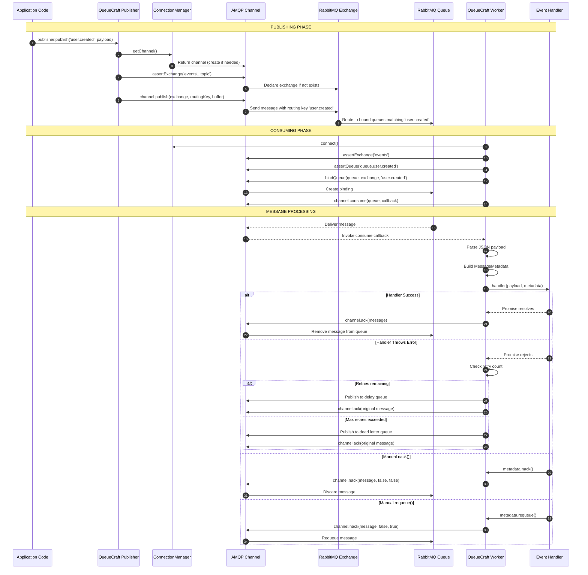

# QueueCraft V2 - Product Requirements Document (PRD)

**Version:** 2.0  
**Date:** December 2024  
**Status:** Draft

---

## Executive Summary

QueueCraft is a TypeScript-based Node.js framework designed to simplify event-driven communication using RabbitMQ (AMQP protocol). It abstracts the complexities of managing RabbitMQ queues, exchanges, publishing, and consuming messages while providing built-in reliability features like automatic retries, dead letter queues, and type-safe event handling.

### Current State
- **Version:** 0.1.0 (Pre-release)
- **Core Functionality:** Publisher/Worker pattern with RabbitMQ
- **Key Strengths:** Type safety, async-first design, automatic retry mechanism
- **Target Users:** Node.js developers building event-driven microservices

---

## Table of Contents

1. [Product Overview](#1-product-overview)
2. [RabbitMQ Fundamentals & QueueCraft Implementation](#2-rabbitmq-fundamentals--queuecraft-implementation)
3. [Architecture Analysis](#3-architecture-analysis)
4. [Current Feature Set](#4-current-feature-set)
5. [Gap Analysis & Missing Features](#5-gap-analysis--missing-features)
6. [Improvement Recommendations](#6-improvement-recommendations)
7. [Technical Debt](#7-technical-debt)
8. [Roadmap Proposal](#8-roadmap-proposal)
9. [Appendix](#appendix)

---

## 1. Product Overview

### 1.1 Vision
Provide the simplest, most type-safe way to implement event-driven architectures with RabbitMQ in Node.js/TypeScript applications.

### 1.2 Core Value Propositions
| Value | Description |
|-------|-------------|
| **Type Safety** | Full TypeScript support with strict mode, type-safe event payloads |
| **Simplicity** | Minimal boilerplate, intuitive API wrapping AMQP concepts |
| **Reliability** | Built-in retry mechanism, dead letter queues, graceful error handling |
| **Developer Experience** | Auto-setup of exchanges/queues, environment variable configuration |

### 1.3 Target Audience
- **Primary:** Backend developers building microservices with Node.js/TypeScript
- **Secondary:** Teams migrating from synchronous to event-driven architectures
- **Tertiary:** Developers new to RabbitMQ seeking a gentle learning curve

---

## 2. RabbitMQ Fundamentals & QueueCraft Implementation

This section explains how RabbitMQ processes messages through exchanges, queues, and bindings, and how QueueCraft abstracts these concepts.

### 2.1 RabbitMQ Core Concepts

#### 2.1.1 The AMQP Model Overview


**Key Components:**
- **Producer**: Application that sends messages (QueueCraft's `Publisher`)
- **Exchange**: Receives messages and routes them to queues based on rules
- **Binding**: Rule that links an exchange to a queue with a routing pattern
- **Queue**: Buffer that stores messages until consumed
- **Consumer**: Application that receives and processes messages (QueueCraft's `Worker`)

### 2.2 Exchange Types Explained

RabbitMQ supports four exchange types. QueueCraft defaults to **Topic** exchange but supports all types.

#### 2.2.1 Topic Exchange (QueueCraft Default)


**Topic Exchange Routing Patterns:**
| Pattern | Matches | Example |
|---------|---------|---------|
| `user.created` | Exact match only | `user.created` ✅ |
| `user.*` | One word after `user.` | `user.created` ✅, `user.updated` ✅, `user.profile.updated` ❌ |
| `user.#` | Zero or more words after `user.` | `user.created` ✅, `user.profile.updated` ✅ |
| `*.created` | Any single word before `.created` | `user.created` ✅, `order.created` ✅ |
| `#` | All messages | Everything ✅ |

#### 2.2.2 Direct Exchange


**Direct Exchange:** Routes messages to queues where `binding_key` exactly matches `routing_key`.

#### 2.2.3 Fanout Exchange


**Fanout Exchange:** Broadcasts messages to ALL bound queues (ignores routing key).

#### 2.2.4 Headers Exchange


**Headers Exchange:** Routes based on message header attributes instead of routing key.

### 2.3 QueueCraft Message Flow in Detail

#### 2.3.1 Complete Publish-Consume Lifecycle



#### 2.3.2 How QueueCraft Creates Bindings

When you define handlers in QueueCraft, it automatically creates the necessary bindings:


**Code Reference (`worker.ts`):**
```typescript
// Queue name generation (line 83)
this.queueName = `queue.${Array.from(events).join('.')}`

// Binding creation (lines 117-119)
for (const event of events) {
  await this.connectionManager.bindQueue(this.queueName, this.exchangeName, String(event))
}
```

#### 2.3.3 Queue Naming Problem & Solutions

**Current Issue:** Queue names are generated by concatenating all event names:

```typescript
// With 3 events → manageable
this.queueName = `queue.user.created.user.updated.user.deleted`

// With 15 events → problematic (255 char limit in RabbitMQ)
this.queueName = `queue.user.created.user.updated.user.deleted.order.placed.order.shipped.order.cancelled.payment.received.payment.failed.notification.email.notification.sms.inventory.updated.inventory.low.cart.updated.cart.abandoned.session.started`
```

**Problems:**
1. RabbitMQ queue names have a **255 character limit**
2. Long names are hard to read in RabbitMQ management UI
3. Queue name changes if handlers are added/removed (breaks existing queues)
4. No semantic meaning - just a list of events

**Recommended Solutions:**

| Approach | Example | Pros | Cons |
|----------|---------|------|------|
| **1. Explicit queue name** | `user-service-events` | Full control, semantic | Manual configuration |
| **2. Service + hash** | `user-service-a1b2c3d4` | Deterministic, short | Hash changes if events change |
| **3. Service name only** | `user-service` | Simple, stable | Requires explicit naming |
| **4. Domain grouping** | `queue.user.*` handlers → `user-events` | Logical grouping | Requires convention |

**Proposed Implementation:**


**Recommended API Change:**

```typescript
// Option 1: Explicit queue name (RECOMMENDED)
const worker = queueCraft.createWorker({
  queueName: 'user-events-worker',  // NEW: explicit name
  handlers: {
    'user.created': handleUserCreated,
    'user.updated': handleUserUpdated,
    // ... 20 more handlers
  }
})

// Option 2: Service-based naming with hash
const worker = queueCraft.createWorker({
  serviceName: 'user-service',  // NEW: generates 'user-service-{hash}'
  handlers: { /* ... */ }
})

// Option 3: Fallback to current behavior (with warning for >5 events)
const worker = queueCraft.createWorker({
  handlers: { /* ... */ }  // Auto-generates concatenated name + logs warning
})
```

**Hash Generation Strategy:**

```typescript
// Deterministic hash from sorted event names
function generateQueueName(serviceName: string, events: string[]): string {
  const sortedEvents = [...events].sort().join(':')
  const hash = crypto
    .createHash('sha256')
    .update(sortedEvents)
    .digest('hex')
    .substring(0, 8)
  
  return `${serviceName}-${hash}`
}

// Example:
// events: ['user.updated', 'user.created', 'order.placed']
// sorted: 'order.placed:user.created:user.updated'
// hash: 'a1b2c3d4'
// result: 'user-service-a1b2c3d4'
```

**Migration Path:**
1. Add optional `queueName` config (backward compatible)
2. Add optional `serviceName` config for hash-based naming
3. Log deprecation warning when auto-generating long names (>100 chars)
4. In v1.0, require explicit naming when handlers > 5

### 2.4 Retry Mechanism & Dead Letter Queue Flow


#### 2.4.1 Retry with Exponential Backoff


**Code Reference (`worker.ts`):**
```typescript
// Delay calculation (lines 272-275)
const delay = Math.min(
  this.retryOptions.initialDelay * Math.pow(this.retryOptions.backoffFactor, retryCount - 1),
  this.retryOptions.maxDelay,
)

// Delay queue setup (lines 284-289)
await channel.assertQueue(delayQueueName, {
  durable: true,
  deadLetterExchange: this.exchangeName,  // Routes back to main exchange
  deadLetterRoutingKey: routingKey,        // With original routing key
  messageTtl: delay,                        // After this delay
})
```

### 2.5 Multi-Worker Scenarios

#### 2.5.1 Competing Consumers Pattern


**Key Points:**
- Multiple worker instances can consume from the same queue
- RabbitMQ distributes messages in round-robin fashion
- `prefetch` controls how many unacknowledged messages each worker holds
- Enables horizontal scaling of message processing

#### 2.5.2 Multiple Event Types per Worker


**Code Reference (`worker.ts`):**
```typescript
// Handler routing (lines 232-243)
const eventKey = String(event) as keyof T & string
const handlerMap = this.config.handlers as EventHandlerMap<T>

if (handlerMap[eventKey]) {
  const handler = handlerMap[eventKey]
  await handler(payload, metadata)
  return
}
```

### 2.6 Connection & Channel Architecture


**Current Implementation Notes:**
- Single TCP connection shared across all publishers/workers
- Single channel for all operations (potential bottleneck)
- Connection is lazily established on first use
- Static `ConnectionManager` means all `QueueCraft` instances share connection

### 2.7 Message Acknowledgment States


### 2.8 QueueCraft Entity Relationship


---

## 3. Architecture Analysis

### 3.1 Core Components

```
┌─────────────────────────────────────────────────────────────────┐
│                         QueueCraft                               │
│  ┌─────────────────────────────────────────────────────────────┐│
│  │                    Main Entry (index.ts)                     ││
│  │  - QueueCraft class (facade)                                 ││
│  │  - createFromEnv() factory                                   ││
│  └─────────────────────────────────────────────────────────────┘│
│                              │                                   │
│         ┌────────────────────┼────────────────────┐              │
│         ▼                    ▼                    ▼              │
│  ┌─────────────┐     ┌─────────────┐     ┌─────────────┐        │
│  │  Publisher  │     │   Worker    │     │ Connection  │        │
│  │             │     │             │     │  Manager    │        │
│  │ - publish() │     │ - start()   │     │             │        │
│  │ - close()   │     │ - stop()    │     │ - connect() │        │
│  └─────────────┘     │ - close()   │     │ - getChannel│        │
│                      │ - retry     │     │ - assert*() │        │
│                      │ - DLQ       │     └─────────────┘        │
│                      └─────────────┘                             │
│                              │                                   │
│  ┌─────────────────────────────────────────────────────────────┐│
│  │                    Supporting Modules                        ││
│  │  - types/index.ts (TypeBox schemas + TypeScript types)       ││
│  │  - logger.ts (Winston + Console logger implementations)      ││
│  │  - utils/validation.ts (Schema validation utilities)         ││
│  └─────────────────────────────────────────────────────────────┘│
└─────────────────────────────────────────────────────────────────┘
```

### 3.2 Data Flow

```
Publisher Flow:
┌──────────┐    ┌───────────┐    ┌──────────┐    ┌──────────┐
│  Client  │───▶│ Publisher │───▶│ Exchange │───▶│  Queue   │
│   Code   │    │  .publish │    │ (topic)  │    │          │
└──────────┘    └───────────┘    └──────────┘    └──────────┘

Worker Flow:
┌──────────┐    ┌───────────┐    ┌──────────┐    ┌──────────┐
│  Queue   │───▶│  Worker   │───▶│ Handler  │───▶│   ACK/   │
│          │    │ .consume  │    │ Function │    │   NACK   │
└──────────┘    └───────────┘    └──────────┘    └──────────┘
                     │                                │
                     ▼                                ▼
              ┌─────────────┐                 ┌─────────────┐
              │ Delay Queue │                 │  Dead Letter│
              │  (Retry)    │                 │    Queue    │
              └─────────────┘                 └─────────────┘
```

### 3.3 File Structure Analysis

```
src/
├── index.ts          # Main entry, QueueCraft class, exports
├── connection.ts     # ConnectionManager - RabbitMQ connection handling
├── publisher.ts      # Publisher class - event publishing
├── worker.ts         # Worker class - event consumption, retry, DLQ
├── logger.ts         # Logger implementations (Winston, Console)
├── types/
│   └── index.ts      # TypeBox schemas + TypeScript type definitions
└── utils/
    └── validation.ts # Schema validation utilities
```

### 3.4 Dependencies Analysis

| Dependency | Version | Purpose | Assessment |
|------------|---------|---------|------------|
| `amqplib` | ^0.8.0 | RabbitMQ client | ⚠️ Outdated (current: 0.10.x) |
| `@sinclair/typebox` | ^0.34.38 | Runtime type validation | ✅ Current |
| `winston` | ^3.11.0 | Logging | ✅ Current |
| `dotenv` | ^16.3.1 | Environment variables | ✅ Current |
| `uuid` | ^9.0.0 | UUID generation | ✅ Current |

---

## 4. Current Feature Set

### 4.1 Core Features

#### ✅ Publisher
- Type-safe event publishing with generic payload maps
- Configurable exchange options (topic, direct, fanout, headers)
- Custom message properties (headers, messageId, timestamp, persistence)
- Auto-initialization of exchanges

#### ✅ Worker
- Type-safe event handlers with payload inference
- Object-based handler pattern for multiple events
- Automatic message acknowledgment
- Manual acknowledgment controls (nack, requeue, deadLetter)
- Configurable prefetch count
- Queue binding to exchanges with routing patterns

#### ✅ Retry Mechanism
- Configurable max retries (default: 3)
- Exponential backoff with configurable parameters
- Delay queue implementation for scheduled retries
- Retry count tracking via message headers

#### ✅ Dead Letter Queue
- Automatic DLQ creation and routing
- Error metadata preservation (original routing key, error message, timestamp)
- Support for DLQ worker processing

#### ✅ Connection Management
- Singleton connection pattern
- Automatic reconnection handling (partial)
- Connection pooling via shared ConnectionManager
- Configurable timeout and heartbeat

#### ✅ Type Safety
- TypeBox runtime validation for configuration
- Generic type parameters for event payload maps
- Strict TypeScript compilation

#### ✅ Logging
- Pluggable logger interface
- Winston logger implementation with file/console transports
- Console logger for simple use cases
- Silent mode for testing

### 4.2 Configuration Options

```typescript
// Connection Options
interface ConnectionOptions {
  host: string
  port: number
  username: string
  password: string
  vhost?: string
  timeout?: number
  heartbeat?: number
}

// Retry Options
interface RetryOptions {
  maxRetries: number      // Default: 3
  initialDelay: number    // Default: 100ms
  backoffFactor: number   // Default: 2
  maxDelay: number        // Default: 5000ms
}

// Exchange Options
interface ExchangeOptions {
  type: 'direct' | 'topic' | 'fanout' | 'headers'
  durable: boolean
  autoDelete: boolean
  arguments?: Record<string, any>
}
```

---

## 5. Gap Analysis & Missing Features

### 5.1 Critical Missing Features (P0)

| Feature | Impact | Effort | Description |
|---------|--------|--------|-------------|
| **Connection Reconnection** | High | Medium | Current implementation clears state on disconnect but lacks automatic reconnection with backoff |
| **Publisher Confirms** | High | Low | No confirmation that messages were received by RabbitMQ broker |
| **Graceful Shutdown** | High | Medium | No built-in signal handling (SIGTERM/SIGINT) for clean worker shutdown |
| **Health Checks** | High | Low | No health check endpoint or method for monitoring connection status |

### 5.2 Important Missing Features (P1)

| Feature | Impact | Effort | Description |
|---------|--------|--------|-------------|
| **Message Priority** | Medium | Low | No support for message priority queues |
| **Message TTL** | Medium | Low | No per-message TTL configuration |
| **Batch Publishing** | Medium | Medium | No batch publish support for high-throughput scenarios |
| **Consumer Concurrency** | Medium | Medium | Single consumer per worker, no parallel processing config |
| **Metrics/Observability** | Medium | Medium | No built-in metrics (message counts, processing times, error rates) |
| **Schema Validation for Payloads** | Medium | Medium | TypeBox schemas exist but payload validation is not enforced |
| **RPC Pattern** | Medium | High | No request-reply pattern support |

### 5.3 Nice-to-Have Features (P2)

| Feature | Impact | Effort | Description |
|---------|--------|--------|-------------|
| **Message Deduplication** | Low | Medium | No built-in deduplication mechanism |
| **Delayed Messages** | Low | Medium | Native delayed message support (requires RabbitMQ plugin) |
| **Message Compression** | Low | Low | No automatic payload compression |
| **Multi-Tenant Support** | Low | High | No vhost management or tenant isolation |
| **Admin API** | Low | High | No queue/exchange management API |
| **Clustering Support** | Low | High | No multi-node RabbitMQ cluster awareness |

### 5.4 Documentation Gaps

| Area | Status | Notes |
|------|--------|-------|
| API Reference | ⚠️ Partial | README covers basics, no JSDoc API docs |
| Error Handling Guide | ❌ Missing | No comprehensive error handling documentation |
| Best Practices | ❌ Missing | No production deployment guide |
| Migration Guide | ❌ Missing | No upgrade path documentation |
| Troubleshooting | ❌ Missing | No common issues/solutions |
| Performance Tuning | ❌ Missing | No optimization guidelines |

---

## 6. Improvement Recommendations

### 6.1 Code Quality Improvements

#### 6.1.1 Connection Manager Enhancements

**Current Issue:** Connection error handling resets state but doesn't attempt reconnection.

```typescript
// Current (connection.ts:119-124)
private handleConnectionError(): void {
  this.connection = null
  this.channel = null
  this.setupExchanges.clear()
  this.setupQueues.clear()
}
```

**Recommendation:** Implement automatic reconnection with exponential backoff.

```typescript
// Proposed enhancement
private async handleConnectionError(): Promise<void> {
  this.connection = null
  this.channel = null
  this.setupExchanges.clear()
  this.setupQueues.clear()
  
  if (this.options.autoReconnect !== false) {
    await this.reconnectWithBackoff()
  }
  
  this.emit('disconnected')
}

private async reconnectWithBackoff(): Promise<void> {
  const maxAttempts = this.options.reconnectAttempts ?? 10
  const baseDelay = this.options.reconnectDelay ?? 1000
  
  for (let attempt = 1; attempt <= maxAttempts; attempt++) {
    try {
      await this.connect()
      this.emit('reconnected')
      return
    } catch (error) {
      const delay = Math.min(baseDelay * Math.pow(2, attempt - 1), 30000)
      await this.sleep(delay)
    }
  }
  
  this.emit('reconnectFailed')
}
```

#### 6.1.2 Publisher Confirms

**Current Issue:** `publish()` returns boolean from channel.publish() but doesn't confirm broker receipt.

**Recommendation:** Add publisher confirms mode.

```typescript
// Proposed enhancement
async publishWithConfirm<E extends keyof T>(
  event: E,
  payload: T[E],
  options?: PublishOptions
): Promise<void> {
  await this.initialize()
  const channel = await this.connectionManager.getConfirmChannel()
  
  return new Promise((resolve, reject) => {
    channel.publish(
      this.exchangeName,
      String(event),
      Buffer.from(JSON.stringify(payload)),
      options,
      (err) => {
        if (err) reject(err)
        else resolve()
      }
    )
  })
}
```

#### 6.1.3 Worker Improvements

**Current Issues:**
1. Queue naming is based on concatenated event names (fragile)
2. No support for custom queue names
3. Console.log used instead of logger in some places

**Recommendations:**

```typescript
// 1. Allow custom queue names
interface WorkerConfig<T> {
  handlers?: EventHandlerMap<T>
  queueName?: string  // NEW: Custom queue name
  options?: WorkerOptions
}

// 2. Use logger consistently (worker.ts has console.log calls)
// Replace: console.log(`Worker started consuming from queue: ${this.queueName}`)
// With: this.logger.info(`Worker started consuming from queue: ${this.queueName}`)

// 3. Add worker events
class Worker<T> extends EventEmitter {
  // Emit events for monitoring
  // 'started', 'stopped', 'messageReceived', 'messageProcessed', 'error'
}
```

### 6.2 API Design Improvements

#### 6.2.1 Fluent Builder Pattern

**Current:** Configuration objects can become complex.

**Recommendation:** Add fluent builder for complex configurations.

```typescript
// Proposed API
const worker = queueCraft
  .worker('user-events')
  .queue({ durable: true, exclusive: false })
  .prefetch(10)
  .retry({ maxRetries: 5, backoffFactor: 2 })
  .on('user.created', async (payload, meta) => { /* ... */ })
  .on('user.updated', async (payload, meta) => { /* ... */ })
  .build()

await worker.start()
```

#### 6.2.2 Middleware Support

**Current:** No middleware pattern for cross-cutting concerns.

**Recommendation:** Add middleware support for logging, tracing, validation.

```typescript
// Proposed API
const worker = queueCraft.createWorker({
  handlers: { /* ... */ },
  middleware: [
    loggingMiddleware(),
    tracingMiddleware({ serviceName: 'user-service' }),
    validationMiddleware(payloadSchemas),
    rateLimitMiddleware({ maxPerSecond: 100 }),
  ]
})
```

#### 6.2.3 Decorator Support (Optional)

**For class-based handlers:**

```typescript
// Proposed API (optional, for decorator enthusiasts)
@Worker({ exchange: 'events', queue: 'user-events' })
class UserEventHandler {
  @Handler('user.created')
  async handleUserCreated(payload: UserCreatedPayload, meta: MessageMetadata) {
    // ...
  }
  
  @Handler('user.updated')
  async handleUserUpdated(payload: UserUpdatedPayload, meta: MessageMetadata) {
    // ...
  }
}
```

### 6.3 Reliability Improvements

#### 6.3.1 Circuit Breaker Pattern

**Recommendation:** Add circuit breaker for external service calls within handlers.

```typescript
// Proposed utility
import { CircuitBreaker } from 'queue-craft/utils'

const emailServiceBreaker = new CircuitBreaker({
  failureThreshold: 5,
  resetTimeout: 30000,
})

const worker = queueCraft.createWorker({
  handlers: {
    'notification.email': async (payload, meta) => {
      await emailServiceBreaker.execute(() => sendEmail(payload))
    }
  }
})
```

#### 6.3.2 Idempotency Support

**Recommendation:** Built-in idempotency key handling.

```typescript
// Proposed API
const worker = queueCraft.createWorker({
  handlers: { /* ... */ },
  options: {
    idempotency: {
      enabled: true,
      keyExtractor: (payload, meta) => meta.properties.messageId,
      store: new RedisIdempotencyStore(redisClient),
      ttl: 86400, // 24 hours
    }
  }
})
```

### 6.4 Observability Improvements

#### 6.4.1 Metrics Collection

**Recommendation:** Add optional metrics collection.

```typescript
// Proposed API
import { PrometheusMetrics } from 'queue-craft/metrics'

const queueCraft = new QueueCraft({
  connection: { /* ... */ },
  metrics: new PrometheusMetrics({
    prefix: 'queuecraft_',
    labels: { service: 'user-service' },
  })
})

// Exposes metrics:
// - queuecraft_messages_published_total
// - queuecraft_messages_consumed_total
// - queuecraft_message_processing_duration_seconds
// - queuecraft_retry_count_total
// - queuecraft_dlq_count_total
// - queuecraft_connection_status
```

#### 6.4.2 Distributed Tracing

**Recommendation:** Add OpenTelemetry integration.

```typescript
// Proposed API
import { OpenTelemetryPlugin } from 'queue-craft/tracing'

const queueCraft = new QueueCraft({
  connection: { /* ... */ },
  plugins: [
    new OpenTelemetryPlugin({
      serviceName: 'user-service',
      propagateContext: true,
    })
  ]
})
```

### 6.5 Testing Improvements

#### 6.5.1 Test Utilities

**Recommendation:** Provide testing utilities.

```typescript
// Proposed API
import { MockQueueCraft, TestPublisher, TestWorker } from 'queue-craft/testing'

describe('UserService', () => {
  const mockQueueCraft = new MockQueueCraft<MyEventPayloadMap>()
  
  it('should publish user.created event', async () => {
    const publisher = mockQueueCraft.createPublisher()
    
    await userService.createUser({ name: 'John' })
    
    expect(publisher.getPublishedMessages('user.created')).toHaveLength(1)
    expect(publisher.getPublishedMessages('user.created')[0]).toMatchObject({
      name: 'John'
    })
  })
  
  it('should handle user.created event', async () => {
    const worker = mockQueueCraft.createWorker({ handlers })
    
    await worker.simulateMessage('user.created', { id: '123', name: 'John' })
    
    expect(mockDatabase.users).toContainEqual({ id: '123', name: 'John' })
  })
})
```

---

## 7. Technical Debt

### 7.1 High Priority

| Issue | Location | Impact | Recommendation |
|-------|----------|--------|----------------|
| Static ConnectionManager | `index.ts:30` | Prevents multiple independent instances | Make instance-based or use dependency injection |
| Console.log in Worker | `worker.ts:213,375,395` | Inconsistent logging | Replace with logger instance |
| Hardcoded queue naming | `worker.ts:83` | Fragile, can cause collisions | Allow custom queue names |
| Missing error types | Throughout | Generic Error objects | Create custom error classes |
| amqplib version | `package.json` | Security/features | Update to ^0.10.x |

### 7.2 Medium Priority

| Issue | Location | Impact | Recommendation |
|-------|----------|--------|----------------|
| Duplicate Logger interface | `types/index.ts`, `logger.ts` | Maintenance burden | Single source of truth |
| No connection events | `connection.ts` | Limited observability | Extend EventEmitter |
| Test coverage gaps | `tests/` | Reliability | Add edge case tests |
| No ESM support | `tsconfig.json` | Modern Node.js | Add dual CJS/ESM build |

### 7.3 Low Priority

| Issue | Location | Impact | Recommendation |
|-------|----------|--------|----------------|
| Sync require for dotenv | `index.ts:199` | Minor | Use dynamic import |
| No source maps in dist | `tsconfig.json` | Debugging | Enable for production builds |
| Missing CHANGELOG | Root | Documentation | Add CHANGELOG.md |
| No CONTRIBUTING guide | Root | Community | Add CONTRIBUTING.md |

---

## 8. Roadmap Proposal

### Phase 1: Stability & Polish (v0.2.0) - 2-3 weeks

**Goal:** Production-ready core functionality

- [ ] Fix static ConnectionManager issue
- [ ] Implement automatic reconnection with backoff
- [ ] Add publisher confirms
- [ ] Replace console.log with logger
- [ ] Update amqplib to latest version
- [ ] Add custom error classes
- [ ] Add health check method
- [ ] Improve test coverage to 90%+
- [ ] Add CHANGELOG.md
- [ ] Add CONTRIBUTING.md

### Phase 2: Observability (v0.3.0) - 2-3 weeks

**Goal:** Production monitoring capabilities

- [ ] Add EventEmitter to ConnectionManager and Worker
- [ ] Add optional metrics collection (Prometheus)
- [ ] Add OpenTelemetry tracing support
- [ ] Add structured logging with correlation IDs
- [ ] Add message processing duration tracking
- [ ] Create observability documentation

### Phase 3: Developer Experience (v0.4.0) - 3-4 weeks

**Goal:** Enhanced DX and flexibility

- [ ] Add custom queue naming support
- [ ] Add middleware pattern
- [ ] Add fluent builder API
- [ ] Add testing utilities package
- [ ] Add payload schema validation option
- [ ] Add batch publishing
- [ ] Create comprehensive API documentation
- [ ] Add more examples (microservices, saga pattern)

### Phase 4: Advanced Features (v0.5.0) - 4-6 weeks

**Goal:** Enterprise-ready features

- [ ] Add RPC pattern support
- [ ] Add message priority support
- [ ] Add consumer concurrency configuration
- [ ] Add circuit breaker utility
- [ ] Add idempotency support
- [ ] Add message deduplication
- [ ] Add delayed message support
- [ ] Performance benchmarks and optimization

### Phase 5: v1.0.0 Release - 2 weeks

**Goal:** Stable public release

- [ ] API freeze and stability guarantee
- [ ] Complete documentation
- [ ] Migration guide from 0.x
- [ ] Performance benchmarks
- [ ] Security audit
- [ ] npm publish with proper versioning

---

## 9. Appendix

### A. Competitive Analysis

| Feature | QueueCraft | BullMQ | Rascal | amqp-connection-manager |
|---------|------------|--------|--------|-------------------------|
| TypeScript Native | ✅ | ✅ | ❌ | ⚠️ |
| Type-Safe Events | ✅ | ⚠️ | ❌ | ❌ |
| Auto Retry | ✅ | ✅ | ✅ | ❌ |
| Dead Letter Queue | ✅ | ✅ | ✅ | ❌ |
| Connection Recovery | ⚠️ | ✅ | ✅ | ✅ |
| Publisher Confirms | ❌ | N/A | ✅ | ✅ |
| Metrics | ❌ | ✅ | ❌ | ❌ |
| RPC Pattern | ❌ | ❌ | ✅ | ❌ |
| Learning Curve | Low | Low | Medium | Low |

### B. Performance Considerations

**Current Bottlenecks:**
1. Single channel per connection (no channel pooling)
2. JSON serialization for all payloads
3. No batch publishing support
4. Synchronous message processing (prefetch helps but limited)

**Optimization Opportunities:**
1. Channel pooling for high-throughput scenarios
2. Optional MessagePack/Protobuf serialization
3. Batch publish with transaction support
4. Parallel message processing within prefetch limit

### C. Security Considerations

**Current State:**
- Credentials passed in plain text (standard for AMQP)
- No TLS/SSL configuration exposed
- No credential rotation support

**Recommendations:**
1. Add TLS configuration options
2. Document secure credential management
3. Add connection string URL support with encoded credentials
4. Consider secrets manager integration examples

### D. Breaking Changes for v1.0

**Proposed Breaking Changes:**
1. Remove static ConnectionManager (breaking)
2. Require explicit queue names or use deterministic naming
3. Make Logger required (no default console logger)
4. Rename `createFromEnv` to `fromEnvironment`
5. Move retry options to top-level worker config

---

*This PRD is a living document and should be updated as the project evolves.*
