# QueueCraft Architecture

This document explains how RabbitMQ processes messages through exchanges, queues, and bindings, and how QueueCraft abstracts these concepts.

## Table of Contents

- [RabbitMQ Core Concepts](#rabbitmq-core-concepts)
- [Exchange Types](#exchange-types)
- [Message Flow](#message-flow)
- [Retry & Dead Letter Queue](#retry--dead-letter-queue)
- [Connection Architecture](#connection-architecture)

---

## RabbitMQ Core Concepts

### The AMQP Model

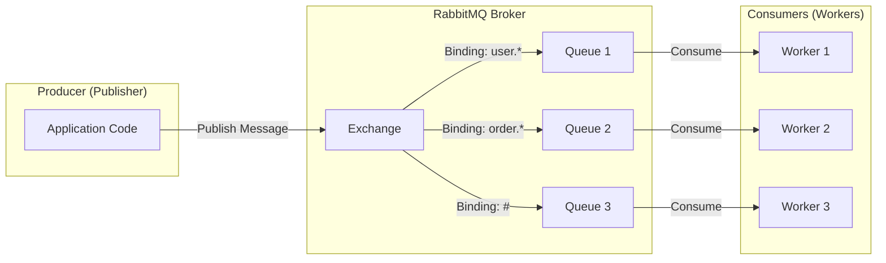

### Key Components

| Component | Description | QueueCraft Abstraction |
|-----------|-------------|------------------------|
| **Producer** | Application that sends messages | `Publisher` class |
| **Exchange** | Receives messages and routes them to queues | Auto-created on publish |
| **Binding** | Rule linking exchange to queue with routing pattern | Auto-created from handlers |
| **Queue** | Buffer storing messages until consumed | Named via `queueName` or `serviceName` |
| **Consumer** | Application receiving and processing messages | `Worker` class |

---

## Exchange Types

QueueCraft defaults to **Topic** exchange but supports all types.

### Topic Exchange (Default)

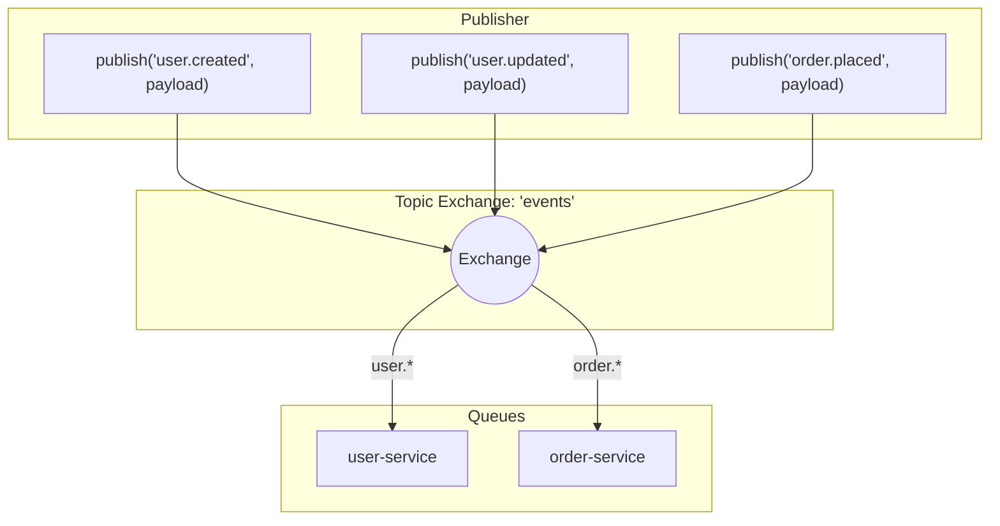

**Routing Patterns:**

| Pattern | Matches | Example |
|---------|---------|---------|
| `user.created` | Exact match only | `user.created` ✅ |
| `user.*` | One word after `user.` | `user.created` ✅, `user.updated` ✅ |
| `user.#` | Zero or more words | `user.created` ✅, `user.profile.updated` ✅ |
| `#` | All messages | Everything ✅ |

### Direct Exchange

Routes messages where `binding_key` exactly matches `routing_key`.

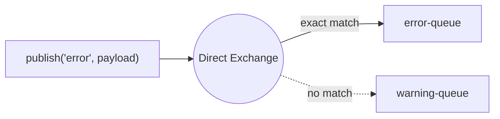

### Fanout Exchange

Broadcasts messages to ALL bound queues (ignores routing key).

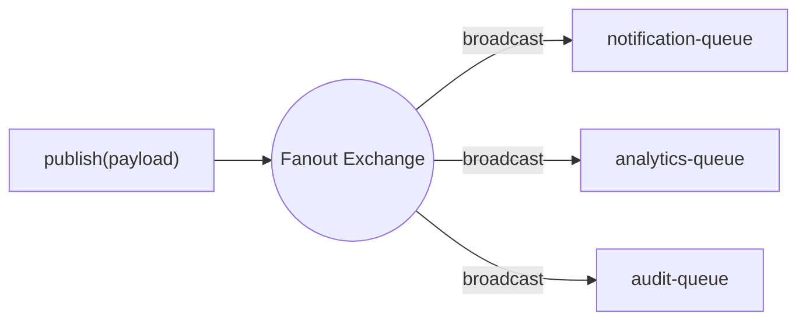

---

## Message Flow

### Complete Publish-Consume Lifecycle

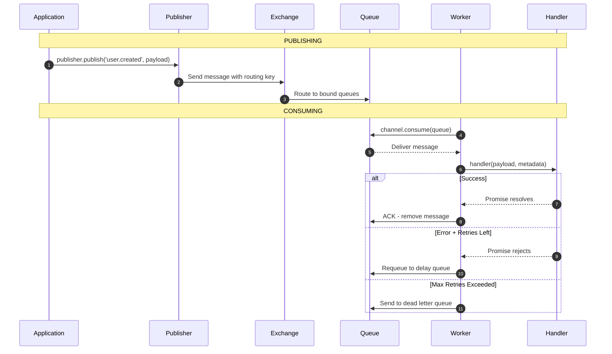

### How Bindings Are Created

When you define handlers, QueueCraft automatically creates bindings:

```typescript
const worker = queueCraft.createWorker({
  queueName: 'user-service',
  handlers: {
    'user.created': handleUserCreated,
    'user.updated': handleUserUpdated,
  }
})
```

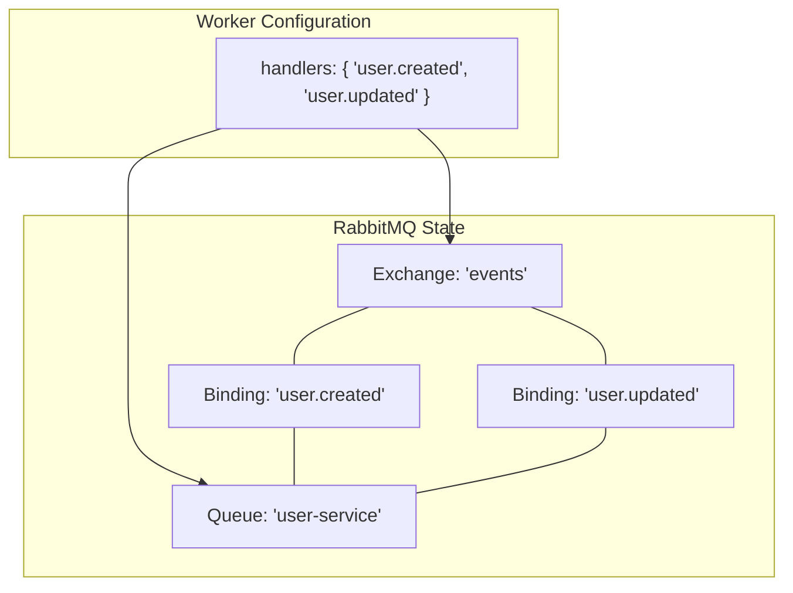

---

## Retry & Dead Letter Queue

### Retry Flow with Exponential Backoff

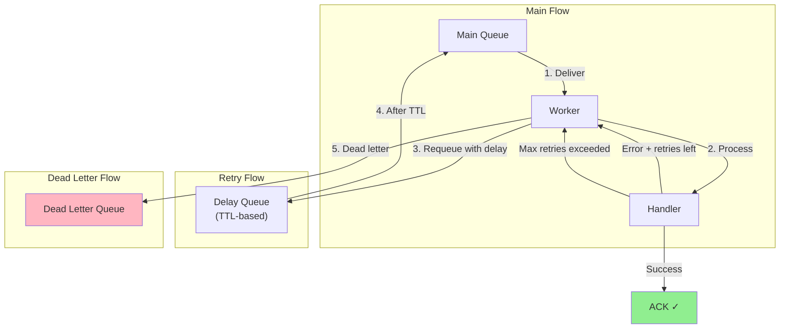

### Retry Timing

With default config: `maxRetries=3, initialDelay=100ms, backoffFactor=2`

| Attempt | Delay | Total Wait |
|---------|-------|------------|
| 1 | 100ms | 100ms |
| 2 | 200ms | 300ms |
| 3 | 400ms | 700ms |
| 4 | → DLQ | - |

---

## Connection Architecture

### Connection Reconnection

QueueCraft automatically handles connection failures with exponential backoff:

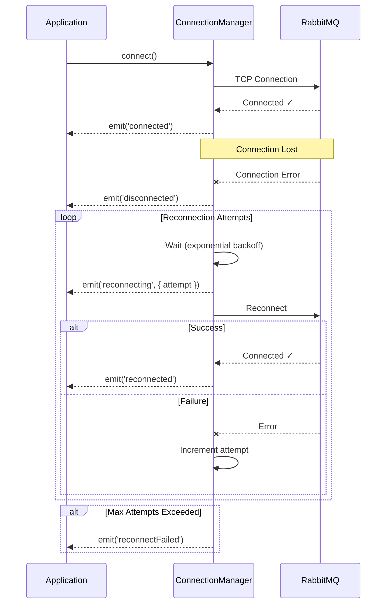

**Reconnection Options:**

| Option | Default | Description |
|--------|---------|-------------|
| `autoReconnect` | `true` | Enable automatic reconnection |
| `maxAttempts` | `10` | Maximum reconnection attempts |
| `initialDelay` | `1000ms` | Initial delay before first retry |
| `maxDelay` | `30000ms` | Maximum delay between retries |
| `backoffFactor` | `2` | Exponential backoff multiplier |

### Health Checks

QueueCraft provides health check methods for monitoring:

```typescript
// Simple boolean check
if (queueCraft.isHealthy()) {
  // Ready to process
}

// Detailed health status
const health = queueCraft.getHealth();
// {
//   healthy: true,
//   connection: {
//     connected: true,
//     reconnecting: false,
//     reconnectAttempts: 0,
//     lastConnectedAt: Date,
//     lastDisconnectedAt: Date,
//     lastError: Error | undefined
//   },
//   publishers: 2,
//   workers: 3,
//   timestamp: Date
// }
```

### QueueCraft Component Structure

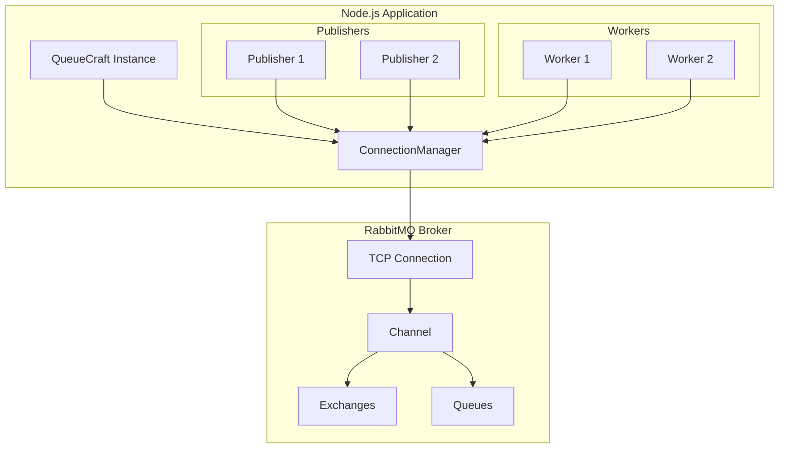

### Message Acknowledgment States

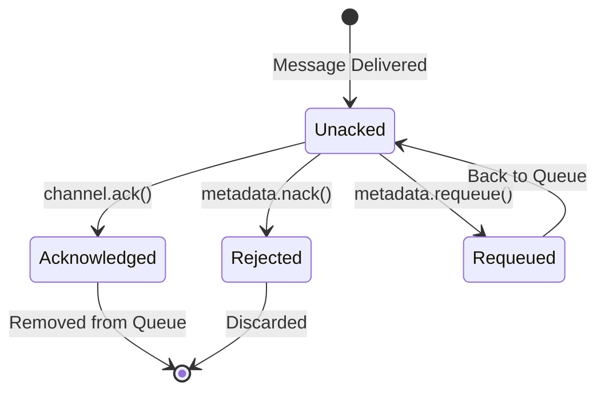

| Method | Effect |
|--------|--------|
| `(auto)` | Message ACKed on successful handler completion |
| `metadata.nack()` | Reject message, don't requeue |
| `metadata.requeue()` | Put message back in queue |
| `metadata.deadLetter()` | Send to dead letter queue |

---

## Entity Relationship

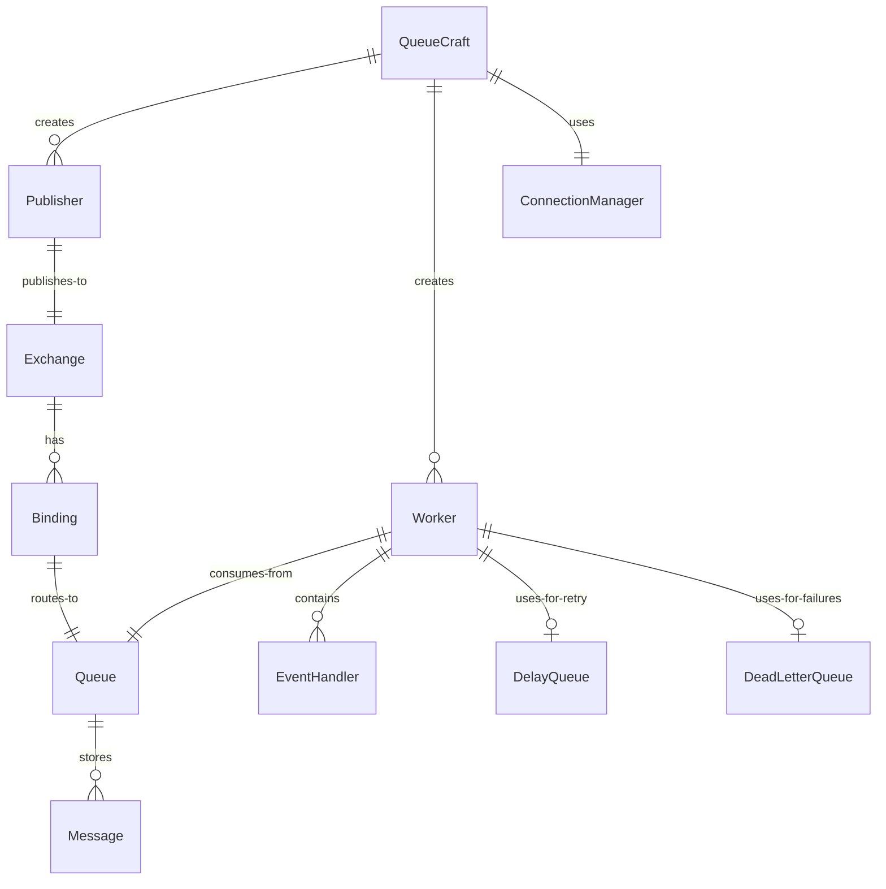

---

## Publisher Confirms

For guaranteed message delivery, use publisher confirms:

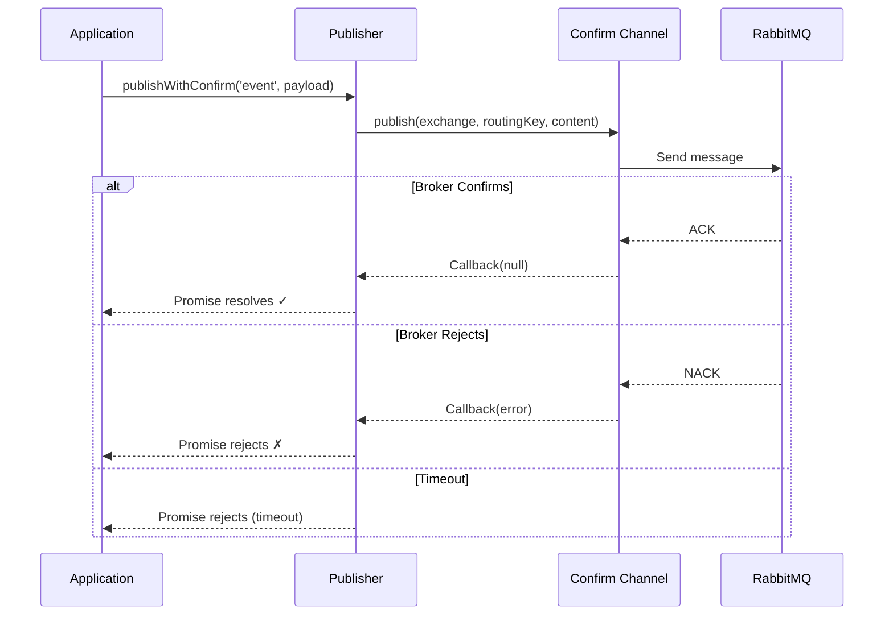

**Usage:**

```typescript
// Fire-and-forget (fast, no guarantee)
await publisher.publish('user.created', payload);

// With confirmation (slower, guaranteed delivery)
await publisher.publishWithConfirm('user.created', payload, {
  timeout: 5000  // Optional timeout in ms
});
```
